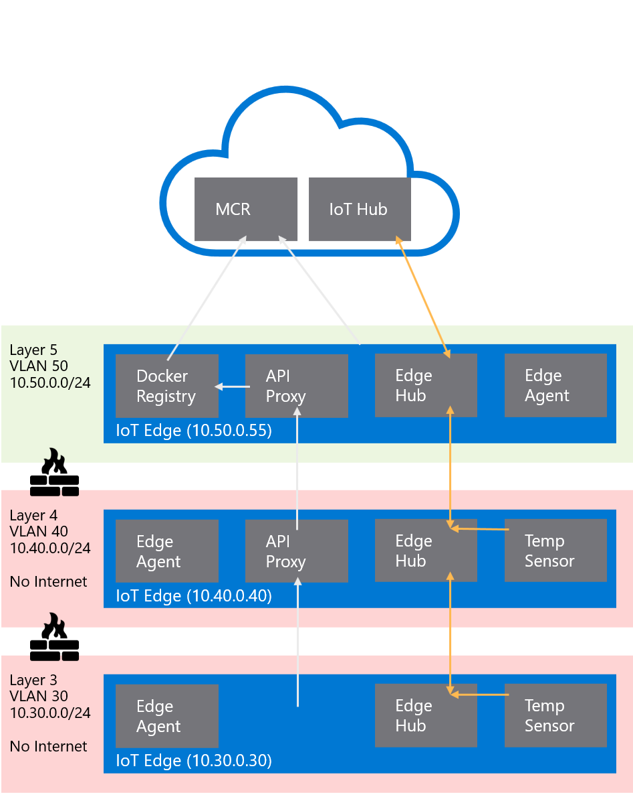

# Building a Nested Edge with multiple gateways with layered deployments

In this guide we show how to implement the new Nested Edge and MQTT Broker functionality within Azure IoT Edge. This is particularly relevant for industrial IoT scenarios where networks layers and heavy connectivity restrictions are common place.

This is based on the official guides here: 
* https://docs.microsoft.com/en-us/azure/iot-edge/tutorial-nested-iot-edge?view=iotedge-2020-11&tabs=azure-portal
* http://aka.ms/iotedge-nested-sample
* http://aka.ms/iotedge-nested-tutorial

It assumes you are already familar with the Azure IoT Edge framework and can perform basic set up and configuration.

## IoT Hub Setup and Deployment Layers

* Create an IoT Hub
* Create IoT Edge device entries for each gateway with your chosen authentication
* For each child gateway make sure to add the parent gateway in the settings
* Create the automatic and layered deployment with the following commands
```bash
# Base deployments
az iot edge deployment create -d connected-edge-baseline-v1 --subscription <subscription id> -n <iot hub name> --content ./manifests/base.topedge.deployment.manifest.json --target-condition "tags.topnestededge=true" --priority 100
az iot edge deployment create -d nested-edge-baseline-v1 --subscription <subscription id> -n <iot hub name> --content ./manifests/base.nestededge.deployment.manifest.json --target-condition "tags.nestedEdge=true" --priority 100

# Layer for middle edge devices that are both offline and act as gateways
az iot edge deployment create -d nestedgatewayedgelayered --subscription <subscription id> -n <iot hub name> --content ./manifests/nestedgateway.layered.deployment.manifest.json --target-condition "tags.nestedgateway=true" --layered --priority 200

# Layer for deploying the simulated temperature sensor
az iot edge deployment create -d tempsensorlayered --subscription <subscription id> -n <iot hub name> --content tempsensor.layered.deployment.manifest.json --target-condition "tags.tempsensor=true" --layered --priority 200

# Layer for the MQTT Broker functionality
az iot edge deployment create -d mqttbrokerlayered-v2 --subscription <subscription id> -n <iot hub name> --content ./manifests/layer.mqttbroker.deployment.manifest.json --target-condition "tags.mqttbroker=true" --layered --priority 300
az iot edge deployment create -d mqttbrokerlayered-v2 --subscription <subscription id> -n <iot hub name> --content ./manifests/layer.mqttbroker.deployment.manifest.json --target-condition "tags.mqttbride=true" --layered --priority 301
```

## Common Gateway Setup (Online)

* Set hostnames 
  * `sudo nano /etc/hostname`
  * `sudo nano /etc/hosts`

* Get clock syncronised
  * `sudo apt install ntp`
  * `sudo systemctl restart ntp`
  * `sudo ntpd -q -g`
  * `sudo hwclock -w`

* Install IoT Edge
  * `sudo apt install curl`
  * `curl https://packages.microsoft.com/config/debian/stretch/multiarch/prod.list > ./microsoft-prod.list`
  * `sudo cp ./microsoft-prod.list /etc/apt/sources.list.d/`
  * `curl https://packages.microsoft.com/keys/microsoft.asc | gpg --dearmor > microsoft.gpg
sudo cp ./microsoft.gpg /etc/apt/trusted.gpg.d/`
  * `sudo apt install apt-transport-https`  
  * `sudo apt update`
  * `sudo apt install moby-engine`
  * Install the preview of IoT Edge
    ```bash
    curl -L https://github.com/Azure/azure-iotedge/releases/download/1.2.0-rc1/libiothsm-std_1.2.0_rc1-1-1_debian9_armhf.deb -o libiothsm-std.deb
    curl -L https://github.com/Azure/azure-iotedge/releases/download/1.2.0-rc1/iotedge_1.2.0_rc1-1_debian9_armhf.deb -o iotedge.deb
    sudo dpkg -i ./libiothsm-std.deb
    sudo dpkg -i ./iotedge.deb
    ```

## Common Gateway Setup (Offline)

* Prepare certificates
  * Follow the [documentation](https://docs.microsoft.com/en-us/azure/iot-edge/how-to-create-test-certificates) for creating test certificates.

    ```bash
    git clone https://github.com/Azure/iotedge.git
    cp <path>/iotedge/tools/CACertificates/*.cnf .
    cp <path>/iotedge/tools/CACertificates/certGen.sh .
    ```
  
  For each device:
  * Create device identity cert `./certGen.sh create_edge_device_identity_certificate "l5edge"`
  * Get thumbprint of cert `openssl x509 -in certs/iot-edge-device-identity-l5edge.cert.pem -text -fingerprint | grep "SHA1 Fingerprint" | sed 's/://g'`
  * Create Edge CA cert `./certGen.sh create_edge_device_ca_certificate "l5edge"`
  * Use WinSCP to copy following over to the edge
    * Root CA Public Cert
    * Device identity certificate and key
    * Device CA certificate and key
  * Trust the root CA for communication
    ```bash
    sudo cp certs/phil-test-lab.root.ca.cert.pem /usr/local/share/ca-certificates/phil-test-lab.root.ca.cert.pem.crt
    sudo update-ca-certificates
    ```
  * Configure IoT Edge in `sudo nano /etc/iotedge/config.yaml` with the following sections
    ```yaml
    # Set the standard authentication for the device
    provisioning:
      source: "manual"
      authentication:
        method: "x509"
        iothub_hostname: "demo-nested-edge-iothub.azure-devices.net"
        device_id: "l4edge"
        identity_cert: "file:///home/moxa/certs/iot-edge-device-identity-l4edge.cert.pem"
        identity_pk: "file:///home/moxa/certs/iot-edge-device-identity-l4edge.key.pem"
      dynamic_reprovisioning: false

    # Set up the certificates for transparent gateway operation
    certificates:
      device_ca_cert: "file:///home/moxa/certs/iot-edge-device-ca-l4edge-full-chain.cert.pem"
      device_ca_pk: "file:///home/moxa/certs/iot-edge-device-ca-l4edge.key.pem"
      trusted_ca_certs: "file:///home/moxa/certs/azure-iot-test-only.root.ca.cert.pem"

    # For nested devices make sure the image host is the parent gateway.
    # For the top level device the host is mcr.microsoft.com
    agent:
      name: "edgeAgent"
      type: "docker"
      env: {}
      config:
        image: "10.50.0.55:443/azureiotedge-agent:1.2.0-rc3"
        auth: {}

    # Set the hostname
    hostname: "10.40.0.40"

    # Set the parent hostname
    parent_hostname: "10.50.0.55"
    ```

## The network environment



In order to make the deployment more realistic, it is helpful to recreate a networking lab environment such as the one described below. This is however not mandatory if not available.

The specific implementation used for creating this guide was set up using the open source OpenWRT on a typical home router (TP-Link Archer C7). The key requirements are:

* Configurable VLANs with individual DHCP services
* Configurable firewall

### Interfaces

The following networks were set up:
* lan - Supervisory Network
    * VLAN ID `1`
    * Untagged on switch `WAN` port
    * 192.168.100.1/24
    * DHCP
    * Unrestricted internet and network access
    * Firewall Zone `lan`
    * **This is purely a convenience mechanism to allow us to easily `ssh` into each device from a single client and wouldn't typically be present in a real environment**
* wan/wwan - Internet connection
    * DHCP Client
    * Connects to host network as client to provide internet connectivity and isolates from host network
    * Firewall Zone `wan`
* L5NET - Layer 5 IT Network
    * VLAN ID `50`
    * Untagged on switch port `1`
    * 10.50.0.1/16
    * DHCP with some static addresses
    * Unrestricted internet access, otherwise isolated
    * Firewall Zone `L5FW`
* L4NET - Layer 4 OT Network
    * VLAN ID `40`
    * Untagged on switch port `2`
    * 10.40.0.1/16
    * DHCP with some static addresses
    * Completely Isolated
    * Firewall Zone `L4FW`
* L3NET - Layer 3 OT Network
    * VLAN ID `30`
    * Untagged on switch ports `3` and `4`
    * 10.30.0.1/16
    * DHCP with some static addresses
    * Completely Isolated
    * Firewall Zone `L3FW`

### Firewall rules
  * lan -> wan, L5FW, L4FW and L3FW
  * wan -> *REJECT*
  * L5FW -> wan
  * L4FW -> *REJECT*
  * L3FW -> *REJECT*
