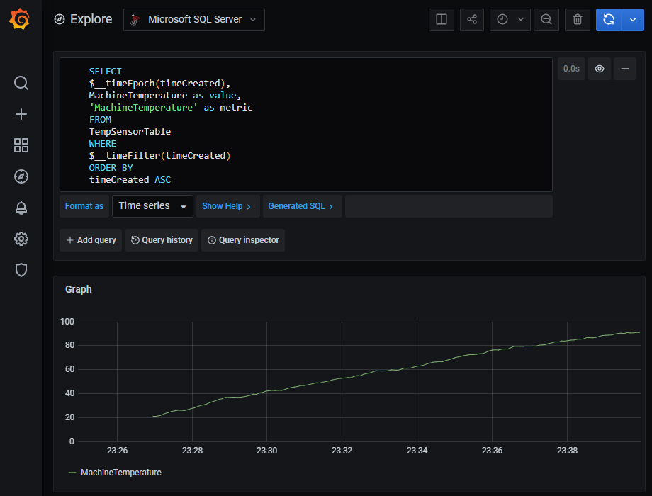

# Azure IoT Edge Solution with Azure SQL Edge and Grafana

The Azure IoT Edge framework allows us to deploy and manage 

**Prerequisites**

There are a number of pre-requisites that are not specific to the task of setting up Azure SQL Edge and Grafana on IoT Edge and so they won't be covered in detail.

* [An Azure IoT Hub (minimum F1 or S1)](https://docs.microsoft.com/en-us/azure/iot-hub/iot-hub-create-through-portal)
* [A running IoT Edge instance connected to the IoT Hub](https://docs.microsoft.com/en-us/azure/iot-edge/quickstart-linux?view=iotedge-2018-06)
* [Azure CLI and Azure IOT extension](https://github.com/azure/azure-iot-cli-extension#installation) installed or Visual Studio Code and the Azure IoT Tools exntesion
* [Azure Data Studio](https://docs.microsoft.com/en-us/sql/azure-data-studio/download-azure-data-studio?view=sql-server-ver15) installed

## Deploying the necessary modules

Once we have our prequisites set up, the first thing we need to do is deploy the three modules we will be using in this walkthrough. They are:

* `Microsoft Simulated Temperature Sensor` to provide sample data in a known and consistent format. You will want to change this for later solutions but for the purpose of this walkthrough we recommend starting with this.
* `Azure SQL Edge` module to provide both the database and the streaming event processing capabilities. You can read more about this service [here]().
* `Grafana` as a third party module to provide visualisation of the data that we persist in the Azure SQL Edge database

The high level architecture of what we are building is as follows:

[todo]

The [deployment manifest](./deployment.manifest.json) can be deployed directly to the IoT Edge device using the `az iot` CLI or via Visual Studio Code and the IoT Edge extension.

`az iot edge set-modules -k deployment.manifest.json -d <Target Device ID> -n <IoT Hub Name> --subscription <Subscription Name or ID>`

You can optionally modifify the manifest to specify your own SQL password which is highly recommended.

## The Simulated Temperature Sensor

The [simulated temeprature sensor](https://azuremarketplace.microsoft.com/en-us/marketplace/apps/azure-iot.simulated-temperature-sensor?tab=Overview) module regularly sends a json payload with multiple attributes. Each message is constructed as follows.

```json
{
    "machine":{
        "temperature":107.46912420516324,
        "pressure":10.850912884132521
    },
    "ambient":{
        "temperature":20.990813444131433,
        "humidity":26
    },
    "timeCreated":"2020-10-28T14:54:33.5259333Z"
}
```
The attributes exhibit the following characteristics:
* Machine Temperature regularly rises from 21C to 100C in regularly with jitter
* Machine Pressure correlates with Temperature 1 to 10psi
* Ambient temperature stable around 21C
* Humidity is stable with tiny jitter around 25%. 

The source code for the module can be found [here](https://github.com/Azure/iotedge/tree/master/edge-modules/SimulatedTemperatureSensor)

> By default the module will send every 5 seconds and stop sending after 500 messages. You can reset this by running `sudo iotedge restart SimTempSensor` directly on the IoT Edge device.

## Configuring Azure SQL Edge

This section is based on the documentation found [here](https://docs.microsoft.com/en-us/azure/azure-sql-edge/create-stream-analytics-job) and extended for the use case. The raw commands can be found [here](sql-notebook.sql)

* Use Azure Data Studio to connect to your Azure SQL Edge instance.
    * Select `New Connection`
    * Connection type: "Microsoft SQL Server"
    * The server address is `<edgehostname or ip address>:1433`
    * Authentication Type is `SQL Login`
    * The username is `sa` and the password `<Default_MSSQL_SA_Password>` unless this was changed in the manifest. 
* Create a new database to host our set up
    * In the Home screen click on `New Query`
    * Paste in the following T-SQL DDL statement and run it. 

    > All subsequent statements should be run in the same way. Just be careful not to re-run old statements again.

    ```sql
    USE master
    GO
    -- Create the new database if it does not exist already
    IF NOT EXISTS (
        SELECT [name]
            FROM sys.databases
            WHERE [name] = N'SQLEdgeTest'
    )
    CREATE DATABASE SQLEdgeTest
    GO
    ```

* Define the Edge Hub input stream
    ```sql
    -- Create a new query and run the following in turn as per https://docs.microsoft.com/en-us/azure/azure-sql-edge/create-stream-analytics-job#example-create-an-external-stream-inputoutput-object-for-azure-iot-edge-hub
    USE SQLEdgeTest
    go
    Create External file format InputFileFormat
    WITH 
    (  
    format_type = JSON,
    )
    go

    CREATE EXTERNAL DATA SOURCE EdgeHubInput 
    WITH 
    (
        LOCATION = 'edgehub://'
    )
    go

    CREATE EXTERNAL STREAM TempSensorStream 
    WITH 
    (
        DATA_SOURCE = EdgeHubInput,
        FILE_FORMAT = InputFileFormat,
        LOCATION = N'TempSensorStream',
        INPUT_OPTIONS = N'',
        OUTPUT_OPTIONS = N''
    );
    go
    ```

* Create the table that will host our data
    ```sql
    USE SQLEdgeTest
    go
    IF OBJECT_ID('[dbo].[TempSensorTable]', 'U') IS NOT NULL
    DROP TABLE [dbo].[TempSensorTable]
    GO
    -- Create the table in the specified schema
    CREATE TABLE [dbo].[TempSensorTable]
    (
        [Id] INT NOT NULL IDENTITY PRIMARY KEY, -- Primary Key column
        [timeCreated] DATETIME NOT NULL,
        [MachineTemperature] FLOAT NOT NULL,
        [MachinePressure] FLOAT NOT NULL,
        [AmbientTemperature] FLOAT NOT NULL,
        [AmbientHumidity] FLOAT NOT NULL
        -- Specify more columns here
    );
    GO
    ```

* Create an encrypted credential store and store our SQL credentials
    ```sql
    -- change the actual encryption password to your own complex password
    CREATE MASTER KEY ENCRYPTION BY PASSWORD = 'sdflkijsd%%#@#$ddff789897ono3nd';

    CREATE DATABASE SCOPED CREDENTIAL SQLCredential
    -- change password to whatever was in the deployment manifest if you changed it
    WITH IDENTITY = 'sa', SECRET = '<Default_MSSQL_SA_Password>'
    go
    ```

* Create the output stream we need to write data back into the database
    ```sql
    CREATE EXTERNAL DATA SOURCE LocalSQLOutput 
    WITH 
    (
        LOCATION = 'sqlserver://tcp:.,1433',
        CREDENTIAL = SQLCredential
    )
    go

    CREATE EXTERNAL STREAM TempSensorTableStream
    WITH 
    (
        DATA_SOURCE = LocalSQLOutput,
        LOCATION = N'SQLEdgeTest.dbo.TempSensorTable',
        INPUT_OPTIONS = N'',
        OUTPUT_OPTIONS = N''
    );
    ```

* Create the streaming job to connect the input and output together
    ```sql
    EXEC sys.sp_create_streaming_job @name=N'TempSensorStreamJob',@statement= N'
    SELECT 
        timeCreated, 
        machine.temperature AS MachineTemperature,
        machine.pressure    AS MachinePressure,
        ambient.temperature AS AmbientTemperature,
        ambient.humidity    AS AmbientHumidity
    INTO TempSensorTableStream
    FROM TempSensorStream'

    exec sys.sp_start_streaming_job @name=N'TempSensorStreamJob'
    -- If you want to change the query you can stop and drop the job before creating it again
    -- exec sys.sp_stop_streaming_job @name=N'TempSensorStreamJob'
    -- exec sys.sp_drop_streaming_job @name=N'TempSensorStreamJob'
    ```

* After a short while you can test whether data is coming through
    ```sql
    -- Check the table
    SELECT TOP (1000) *
    FROM [SQLEdgeTest].[dbo].[TempSensorTable]

    -- Check on the status of the job    
    exec sys.sp_get_streaming_job @name=N'TempSensorStreamJob'
    WITH RESULT SETS ((name nvarchar(256),status nvarchar(256),error nvarchar(256)))
    ```

## Configuring Grafana

* Go to [edgehost:3000](http://localhost:3000)
* Login with admin:admin and supply a new password when prompted
* Add a new 'Microsoft SQL Server' data source 
    * Host: `AzureSQLEdge:1433`
    * Database: `SQLEdgeTest`
    * User: `sa`
    * Password: `<Default_MSSQL_SA_Password>`
    * Encrypt: `false`
* You can now use Grafana as you would with any other SQL Server source 🎉
* Click on the `Explore` menu on the left side
* Paste in the following query and run it
    ```sql
    SELECT
    $__timeEpoch(timeCreated),
    MachineTemperature as value,
    'MachineTemperature' as metric
    FROM
    TempSensorTable
    WHERE
    $__timeFilter(timeCreated)
    ORDER BY
    timeCreated ASC
    ```
